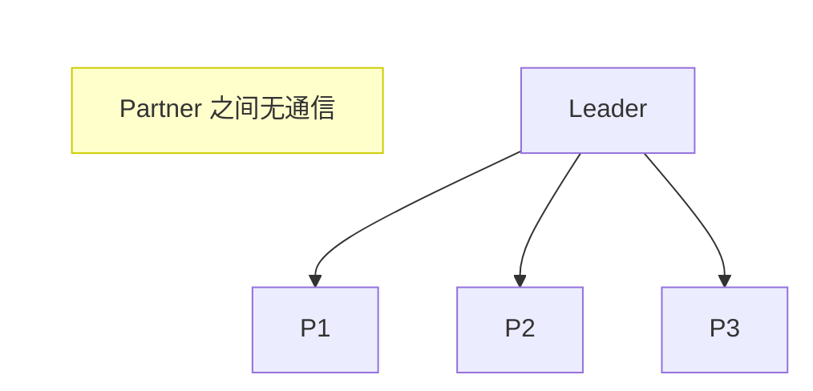
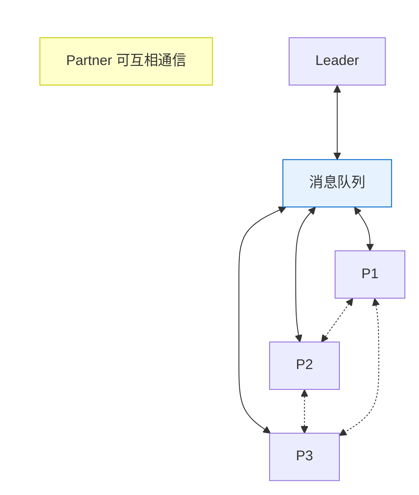
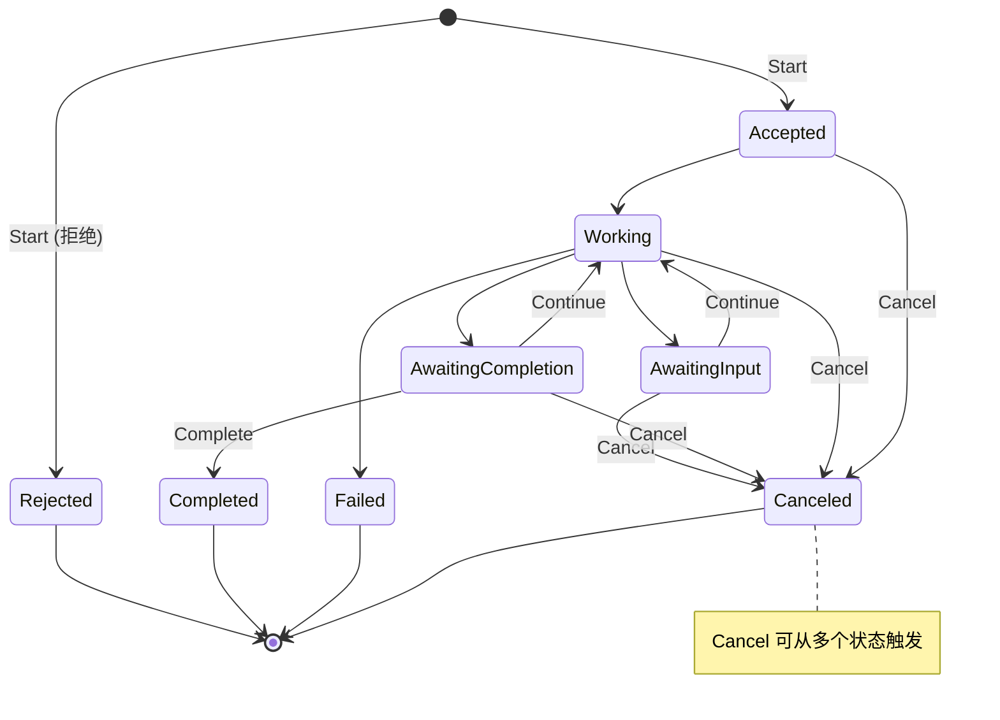

# AIP 协议 SDK 开发教程

本教程介绍如何使用 `acps_sdk` 进行 AIP（Agent Interaction Protocol，智能体交互协议）开发。我们将详细讲解 AIP 的基本概念、SDK 的主要内容和边界，以及如何利用 SDK 开发 Partner 和 Leader 智能体。

> **参考文档**: [ACPs-spec-AIP.md](../../acps-specs/07-ACPs-spec-AIP/ACPs-spec-AIP.md) - AIP 协议规范完整定义

---

## 目录

1. [AIP 协议基本概念](#1-aip-协议基本概念)
   - [1.1 角色定义](#11-角色定义)
   - [1.2 交互模式](#12-交互模式)
   - [1.3 核心数据对象](#13-核心数据对象)
   - [1.4 任务状态机](#14-任务状态机)
2. [SDK 架构](#2-sdk-架构)
   - [2.1 SDK 模块结构](#21-sdk-模块结构)
3. [直连模式开发](#3-直连模式开发)
   - [3.1 Partner 端开发](#31-partner-端开发)
   - [3.2 Leader 端开发](#32-leader-端开发)
4. [群组模式开发](#4-群组模式开发)
   - [4.1 Partner 端开发](#41-partner-端开发)
   - [4.2 Leader 端开发](#42-leader-端开发)
5. [实战示例](#5-实战示例)

---

## 1. AIP 协议基本概念

AIP（Agent Interaction Protocol）是 ACPs 协议体系中用于规范智能体之间交互的核心协议。它定义了智能体如何协作、委托任务和交换信息。

### 1.1 角色定义

AIP 协议定义了两种核心角色：

| 角色                  | 说明                                                                                      |
| --------------------- | ----------------------------------------------------------------------------------------- |
| **Leader（领导者）**  | 发布任务并组织交互的智能体。在一次完整的交互中，只能有一个 Leader。负责任务的创建与终止。 |
| **Partner（参与者）** | 接受任务并提供服务的智能体。Partner 接受来自 Leader 的任务后执行并返回执行结果。          |

在本项目中：

- **Leader**: 位于 `leader/` 目录，作为用户交互的桥梁，负责协调多个 Partner 完成复杂任务
- **Partner**: 位于 `partners/` 目录，每个online子目录是一个专业领域的 Partner（如北京城区景点、美食推荐等）

### 1.2 交互模式

AIP 支持三种交互模式：

#### (1) 直连模式（Direct Interaction Mode）

Leader 直接与每个 Partner 进行一对一交互，Partner 之间无交互。这是最基础的交互模式。



**实现方式**:

- **RPC 方式**: 基础的请求-响应模式
- **流式传输（SSE）**: 适用于大数据或实时推送
- **异步通知**: 基于回调的非阻塞通信

#### (2) 群组模式（Grouping Interaction Mode）

Leader 创建群组，通过消息队列（如 RabbitMQ）进行消息分发。所有群组成员均可发送和接收消息。



**特点**:

- 消息透明：所有成员可见群组内消息
- 通过 `mentions` 字段指定消息接收者
- 支持多 Partner 协作

#### (3) 混合模式（Hybrid Interaction Mode）

在同一 Session 内，Leader 可以同时使用直连模式和群组模式与不同 Partner 交互。

### 1.3 核心数据对象

AIP 协议定义了一套完整的数据对象体系，所有对象都继承自 `Message` 基类。

#### Message（消息基类）

所有交互数据的基类，定义了通用的消息属性：

```python
from acps_sdk.aip import Message

# Message 是所有交互数据的基类
class Message(BaseModel):
    type: str = "message"           # 对象类型标识符
    id: str                         # 消息唯一标识符
    sentAt: str                     # 发送时间 (ISO 8601)
    senderRole: Literal["leader", "partner"]  # 发送者角色
    senderId: str                   # 发送者的 AIC
    mentions: Optional[Union[Literal["all"], List[str]]] = None  # 群组模式下的提及
    dataItems: Optional[List[DataItem]] = None  # 消息内容
    groupId: Optional[str] = None   # 群组 ID
    sessionId: Optional[str] = None # 会话 ID
```

#### TaskCommand（任务命令）

Leader 向 Partner 发送的任务控制命令：

```python
from acps_sdk.aip import TaskCommand, TaskCommandType

# 创建一个启动任务的命令
command = TaskCommand(
    id="msg-001",
    sentAt="2025-01-27T10:00:00+08:00",
    senderRole="leader",
    senderId="leader-aic-001",
    command=TaskCommandType.Start,  # 命令类型
    taskId="task-001",
    sessionId="session-001",
    dataItems=[TextDataItem(text="请推荐北京的景点")]
)
```

**命令类型 (TaskCommandType)**:

| 命令       | 说明                                                   |
| ---------- | ------------------------------------------------------ |
| `Start`    | 开始任务                                               |
| `Continue` | 继续任务（用于 AwaitingInput/AwaitingCompletion 状态） |
| `Cancel`   | 取消任务                                               |
| `Complete` | 完成任务（确认 Partner 的产出物）                      |
| `Get`      | 获取任务当前状态                                       |
| `ReStream` | 重连流式传输                                           |

#### TaskResult（任务结果）

Partner 向 Leader 返回的任务状态和结果：

```python
from acps_sdk.aip import TaskResult, TaskStatus, TaskState, Product

# 创建一个任务结果
result = TaskResult(
    id="msg-002",
    sentAt="2025-01-27T10:00:01+08:00",
    senderRole="partner",
    senderId="partner-aic-001",
    taskId="task-001",
    status=TaskStatus(
        state=TaskState.AwaitingCompletion,
        stateChangedAt="2025-01-27T10:00:01+08:00",
    ),
    products=[
        Product(
            id="product-001",
            name="景点推荐",
            dataItems=[TextDataItem(text="推荐您参观故宫...")]
        )
    ],
    sessionId="session-001"
)
```

#### DataItem（数据项）

消息或产出物中的内容片段，支持三种类型：

```python
from acps_sdk.aip import TextDataItem, FileDataItem, StructuredDataItem

# 文本数据项
text_item = TextDataItem(text="这是一段文本")

# 文件数据项
file_item = FileDataItem(
    name="image.jpg",
    mimeType="image/jpeg",
    bytes="base64编码内容..."  # 或使用 uri 指向外部文件
)

# 结构化数据项
data_item = StructuredDataItem(data={"key": "value", "list": [1, 2, 3]})
```

### 1.4 任务状态机

任务在生命周期中经历多个状态，状态转移遵循严格的规则：



**状态说明**:

| 状态                 | 说明                                   |
| -------------------- | -------------------------------------- |
| `Accepted`           | Partner 接受了任务，准备开始处理       |
| `Rejected`           | Partner 拒绝了任务（如超出能力范围）   |
| `Working`            | 任务正在执行中                         |
| `AwaitingInput`      | Partner 需要更多信息才能继续           |
| `AwaitingCompletion` | Partner 已生成产出物，等待 Leader 确认 |
| `Completed`          | 任务成功完成（终态）                   |
| `Failed`             | 任务执行失败（终态）                   |
| `Canceled`           | 任务被取消（终态）                     |

---

## 2. SDK 架构

### 2.1 SDK 模块结构

`acps_sdk.aip` 包提供了 AIP 协议的完整实现：

```
acps_sdk/aip/
├── __init__.py              # 公共导出
├── aip_base_model.py        # 基础数据模型 (Message, TaskCommand, TaskResult 等)
├── aip_rpc_model.py         # RPC 数据模型 (JSONRPCRequest/Response)
├── aip_stream_model.py      # 流式传输数据模型 (SSE 事件)
├── aip_rpc_client.py        # RPC 客户端 (Leader 端使用)
├── aip_rpc_server.py        # RPC 服务端框架 (Partner 端使用)
├── aip_group_model.py       # 群组模式数据模型
├── aip_group_leader.py      # 群组模式 Leader 客户端
├── aip_group_partner.py     # 群组模式 Partner 客户端
└── mtls_config.py           # mTLS 配置
```

---

## 3. 直连模式开发

### 3.1 Partner 端开发

Partner 端使用 SDK 提供的服务端框架响应 Leader 的 RPC 请求。

#### 3.1.1 基本架构

```python
# partners/main.py - Partner 服务入口
from fastapi import FastAPI
from acps_sdk.aip.aip_rpc_model import RpcRequest, RpcResponse

app = FastAPI()

@app.post("/partners/{agent_name}/rpc", response_model=RpcResponse)
async def rpc_endpoint(agent_name: str, request: RpcRequest):
    # 分发到对应的 Agent 处理
    return await manager.dispatch(agent_name, request)
```

#### 3.1.2 使用 CommandHandlers 框架

SDK 提供了 `CommandHandlers` 框架来处理不同的任务命令：

```python
# partners/generic_runner.py
from acps_sdk.aip.aip_rpc_server import CommandHandlers, DefaultHandlers
from acps_sdk.aip.aip_base_model import TaskCommand, TaskResult, TaskState

class GenericRunner:
    def __init__(self, agent_name: str, base_dir: str):
        self.agent_name = agent_name

        # 注册命令处理器
        self.handlers = CommandHandlers(
            on_start=self.on_start,      # 处理 Start 命令
            on_get=self.on_get,          # 处理 Get 命令
            on_cancel=self.on_cancel,    # 处理 Cancel 命令
            on_complete=self.on_complete,# 处理 Complete 命令
            on_continue=self.on_continue,# 处理 Continue 命令
        )

    async def on_start(self, command: TaskCommand, task: Optional[TaskResult]) -> TaskResult:
        """处理 Start 命令 - 创建新任务"""
        # 1. 意图识别与准入判断
        decision = await self._decision_phase(command)

        if decision.action == "reject":
            # 拒绝任务
            return self._create_rejected_result(command, decision.reason)

        # 2. 创建并返回 Accepted 状态的任务
        task = self._create_task(command, TaskState.Accepted)

        # 3. 异步开始执行任务
        asyncio.create_task(self._execute_task(command.taskId))

        return task

    async def on_continue(self, command: TaskCommand, task: TaskResult) -> TaskResult:
        """处理 Continue 命令 - 继续执行任务"""
        # 检查当前状态是否允许 continue
        if task.status.state not in (TaskState.AwaitingInput, TaskState.AwaitingCompletion):
            return task  # 忽略无效的 continue

        # 更新任务状态为 Working
        return self._update_task_status(command.taskId, TaskState.Working)
```

#### 3.1.3 任务生命周期实现

以下是一个典型的 Partner 任务处理流程：

```python
async def _execute_task(self, task_id: str):
    """执行任务的完整生命周期"""
    try:
        # 阶段 1: 更新为 Working 状态
        self._update_task_status(task_id, TaskState.Working)

        # 阶段 2: 需求分析
        requirements = await self._analyze_requirements(task_id)

        if requirements.needs_more_info:
            # 信息不足，等待用户输入
            self._update_task_status(
                task_id,
                TaskState.AwaitingInput,
                data_items=[TextDataItem(text=requirements.question)]
            )
            return  # 等待 Continue 命令

        # 阶段 3: 生成产出物
        product = await self._generate_product(task_id, requirements)

        # 阶段 4: 提交产出物，等待确认
        task = self.tasks[task_id].task
        task.products = [product]
        self._update_task_status(task_id, TaskState.AwaitingCompletion)

    except Exception as e:
        # 任务失败
        self._update_task_status(
            task_id,
            TaskState.Failed,
            data_items=[TextDataItem(text=f"执行失败: {str(e)}")]
        )
```

#### 3.1.4 配置文件结构

每个 Partner Agent 需要以下配置文件：

```
partners/online/<agent_name>/
├── acs.json       # ACS 定义 (身份与能力)
├── config.toml    # 运行配置 (LLM、日志等)
└── prompts.toml   # Prompt 模板 (业务逻辑)
```

**acs.json 示例**:

```json
{
  "aic": "10001000011K9DX1GW14X1VSP2QQNG44",
  "name": "北京城区旅游智能体",
  "description": "为北京城六区提供景点推荐和行程规划服务",
  "capabilities": {
    "streaming": false,
    "notification": false,
    "messageQueue": ["rabbitmq:4.2"]
  },
  "skills": [
    {
      "id": "beijing_urban.cultural-attraction-recommendation",
      "name": "文化景点推荐",
      "description": "推荐北京城区的历史文化景点"
    }
  ]
}
```

### 3.2 Leader 端开发

Leader 端使用 `AipRpcClient` 与 Partner 通信。

#### 3.2.1 使用 AipRpcClient

```python
# leader/assistant/core/executor.py
from acps_sdk.aip.aip_rpc_client import AipRpcClient
from acps_sdk.aip.aip_base_model import TaskResult, TaskState

class TaskExecutor:
    def __init__(self, leader_aic: str):
        self.leader_aic = leader_aic
        self._rpc_clients: Dict[str, AipRpcClient] = {}

    async def _get_client(self, partner_url: str) -> AipRpcClient:
        """获取或创建 RPC 客户端"""
        if partner_url not in self._rpc_clients:
            self._rpc_clients[partner_url] = AipRpcClient(
                partner_url=partner_url,
                leader_id=self.leader_aic
            )
        return self._rpc_clients[partner_url]

    async def start_task(self, partner_url: str, session_id: str, user_input: str) -> TaskResult:
        """向 Partner 发起任务"""
        client = await self._get_client(partner_url)
        return await client.start_task(session_id, user_input)

    async def continue_task(self, partner_url: str, task_id: str, session_id: str, user_input: str) -> TaskResult:
        """继续 Partner 的任务"""
        client = await self._get_client(partner_url)
        return await client.continue_task(task_id, session_id, user_input)

    async def complete_task(self, partner_url: str, task_id: str, session_id: str) -> TaskResult:
        """确认 Partner 的产出物"""
        client = await self._get_client(partner_url)
        return await client.complete_task(task_id, session_id)
```

#### 3.2.2 轮询模式执行

Leader 通常需要轮询 Partner 状态直到任务收敛：

```python
async def execute_until_converged(
    self,
    session_id: str,
    partner_tasks: Dict[str, PartnerTask],
) -> ExecutionResult:
    """执行任务直到所有 Partner 状态收敛"""

    result = ExecutionResult(phase=ExecutionPhase.STARTING)

    # Phase 1: 并发下发 start 命令
    start_tasks = [
        self._start_partner(session_id, task)
        for task in partner_tasks.values()
    ]
    await asyncio.gather(*start_tasks)

    # Phase 2: 轮询直到收敛
    start_time = datetime.now()
    while not self._is_converged(result):
        if (datetime.now() - start_time).seconds > self.config.convergence_timeout_s:
            result.phase = ExecutionPhase.TIMEOUT
            break

        # 获取所有 Partner 的最新状态
        await self._poll_all_partners(partner_tasks, result)

        # 检查是否有 Partner 需要输入
        if result.awaiting_input_partners:
            result.phase = ExecutionPhase.AWAITING_INPUT
            break

        # 检查是否所有 Partner 都完成或等待确认
        if self._all_awaiting_completion(result):
            result.phase = ExecutionPhase.AWAITING_COMPLETION
            break

        await asyncio.sleep(self.config.poll_interval_ms / 1000)

    return result

def _is_converged(self, result: ExecutionResult) -> bool:
    """检查是否所有任务都达到终态"""
    terminal_states = {TaskState.Completed, TaskState.Failed, TaskState.Canceled, TaskState.Rejected}
    for partner_result in result.partner_results.values():
        if partner_result.state not in terminal_states:
            return False
    return True
```

---

## 4. 群组模式开发

群组模式通过 RabbitMQ 消息队列实现多 Partner 协作。

### 4.1 Partner 端开发

#### 4.1.1 处理群组邀请

Partner 需要响应 Leader 的群组邀请请求：

```python
# partners/group_handler.py
from acps_sdk.aip.aip_group_partner import GroupPartnerMqClient, PartnerGroupState
from acps_sdk.aip.aip_group_model import RabbitMQRequest, RabbitMQResponse

class GroupHandler:
    def __init__(self, agent_name: str, runner: GenericRunner):
        self.agent_name = agent_name
        self.runner = runner
        self.partner_aic = runner.acs.get("aic")

        # 群组客户端缓存 (group_id -> client)
        self._group_clients: Dict[str, GroupPartnerMqClient] = {}

    async def handle_group_rpc(self, request: RabbitMQRequest) -> RabbitMQResponse:
        """处理群组邀请请求"""
        if request.method == "group":
            return await self._handle_join_group(request)
        return RabbitMQResponse(
            id=request.id,
            error={"code": -32601, "message": "Method not found"}
        )

    async def _handle_join_group(self, request: RabbitMQRequest) -> RabbitMQResponse:
        """加入群组"""
        group_id = request.params.group.groupId

        # 创建群组客户端
        client = GroupPartnerMqClient(partner_aic=self.partner_aic)

        # 设置消息处理器
        client.set_command_handler(self._on_task_command)
        client.set_task_result_handler(self._on_task_result)
        client.set_mgmt_command_handler(self._on_mgmt_command)

        # 加入群组
        response = await client.join_group(request)

        if response.result:
            self._group_clients[group_id] = client

        return response
```

#### 4.1.2 处理群组任务命令

```python
async def _on_task_command(self, command: TaskCommand, is_mentioned: bool) -> None:
    """处理来自群组的任务命令"""
    # 如果没有被提及，不处理
    if not is_mentioned:
        return

    # 记录任务到群组的映射
    self._task_group_map[command.taskId] = command.groupId

    # 根据命令类型处理
    if command.command == TaskCommandType.Start:
        # 处理 start 命令
        task_result = await self.runner.on_start(command, None)
        # 广播状态更新到群组
        await self._broadcast_task_update(task_result, command.groupId)

    elif command.command == TaskCommandType.Continue:
        task_ctx = self.runner.tasks.get(command.taskId)
        if task_ctx:
            task_result = await self.runner.on_continue(command, task_ctx.task)
            await self._broadcast_task_update(task_result, command.groupId)
```

#### 4.1.3 发送任务状态更新

```python
async def _broadcast_task_update(self, task_result: TaskResult, group_id: str) -> None:
    """广播任务状态更新到群组"""
    client = self._group_clients.get(group_id)
    if not client or not client.is_joined:
        return

    # 使用 SDK 方法发送状态更新
    await client.send_task_result(
        task_id=task_result.taskId,
        session_id=task_result.sessionId,
        state=task_result.status.state,
        products=task_result.products,
        status_data_items=task_result.status.dataItems,
    )
```

### 4.2 Leader 端开发

#### 4.2.1 群组管理器

```python
# leader/assistant/core/group_manager.py
from acps_sdk.aip.aip_group_leader import GroupLeader, GroupLeaderMqClient, PartnerConnectionInfo
from acps_sdk.aip.aip_group_model import ACSObject

class GroupManager:
    def __init__(
        self,
        leader_aic: str,
        rabbitmq_config: RabbitMQConfig,
    ):
        self.leader_aic = leader_aic
        self.rabbitmq_config = rabbitmq_config

        # SDK GroupLeader 实例
        self._group_leader: Optional[GroupLeader] = None

        # Session ID -> 群组 ID 映射
        self._session_group_map: Dict[str, str] = {}

    async def start(self) -> None:
        """启动群组管理器"""
        self._group_leader = GroupLeader(
            leader_aic=self.leader_aic,
            rabbitmq_config={
                "host": self.rabbitmq_config.host,
                "port": self.rabbitmq_config.port,
                "user": self.rabbitmq_config.user,
                "password": self.rabbitmq_config.password,
                "vhost": self.rabbitmq_config.vhost,
            },
        )

    async def create_group_for_session(self, session_id: str) -> str:
        """为 Session 创建群组"""
        if session_id in self._session_group_map:
            return self._session_group_map[session_id]

        group_session = await self._group_leader.create_group_session(
            session_id=session_id,
            initial_partners=[],
        )

        self._session_group_map[session_id] = group_session.group_id
        return group_session.group_id
```

#### 4.2.2 邀请 Partner 加入群组

```python
async def invite_partner(
    self,
    session_id: str,
    partner_acs: ACSObject,
    partner_rpc_url: str,
) -> PartnerConnectionInfo:
    """邀请 Partner 加入群组"""
    group_session = await self._get_group_session(session_id)

    # 使用 SDK 邀请 Partner
    partner_info = await group_session.mq_client.invite_partner(
        partner_acs=partner_acs,
        partner_rpc_url=partner_rpc_url,
        timeout=self.config.partner_join_timeout,
    )

    logger.info(f"Partner {partner_acs.aic} joined group {group_session.group_id}")
    return partner_info
```

#### 4.2.3 群组模式任务执行器

```python
# leader/assistant/core/group_executor.py
class GroupTaskExecutor:
    """群组模式任务执行器"""

    def __init__(self, leader_aic: str, group_manager: GroupManager):
        self.leader_aic = leader_aic
        self.group_manager = group_manager

    async def execute(
        self,
        session_id: str,
        active_task_id: str,
        planning_result: PlanningResult,
    ) -> ExecutionResult:
        """执行任务（群组模式）"""

        result = ExecutionResult(phase=ExecutionPhase.STARTING)

        # Phase 0: 确保群组已创建
        group_id = await self.group_manager.create_group_for_session(session_id)

        # Phase 1: 邀请未加入群组的 Partner
        for partner in planning_result.selected_partners:
            if not await self._is_partner_in_group(session_id, partner.aic):
                await self.group_manager.invite_partner(
                    session_id,
                    ACSObject(aic=partner.aic),
                    partner.rpc_url,
                )

        # Phase 2: 发送 start 命令到群组
        group_session = await self.group_manager._get_group_session(session_id)

        for partner in planning_result.selected_partners:
            await group_session.mq_client.start_task(
                session_id=session_id,
                text_content=partner.task_content,
                task_id=f"{active_task_id}-{partner.aic}",
                mentions=[partner.aic],  # 只提及特定 Partner
            )

        # Phase 3: 等待状态收敛（通过消息队列接收更新）
        result = await self._wait_until_converged(session_id, planning_result, result)

        return result
```

#### 4.2.4 处理群组消息

```python
async def _setup_message_handler(self, session_id: str):
    """设置群组消息处理器"""
    group_session = await self.group_manager._get_group_session(session_id)

    async def handle_message(message):
        if isinstance(message, TaskResult):
            await self._on_task_result(session_id, message)
        elif isinstance(message, GroupMgmtResult):
            await self._on_mgmt_result(session_id, message)

    group_session.mq_client.set_message_handler(handle_message)

async def _on_task_result(self, session_id: str, result: TaskResult):
    """处理 Partner 的任务状态更新"""
    partner_aic = result.senderId
    task_id = result.taskId
    state = result.status.state

    # 更新本地状态缓存
    self._update_partner_state(session_id, partner_aic, task_id, state)

    # 检查是否需要触发回调
    if state == TaskState.AwaitingCompletion:
        # Partner 提交了产出物
        products = result.products
        await self._handle_products(session_id, partner_aic, products)

    elif state == TaskState.AwaitingInput:
        # Partner 需要更多输入
        question = self._extract_question(result)
        await self._handle_question(session_id, partner_aic, question)
```

---

## 5. 最简实战示例

### 5.1 完整的 Partner 实现示例

以下是一个简化的 Partner 完整实现：

```python
from fastapi import FastAPI
from acps_sdk.aip import (
    TaskCommand, TaskResult, TaskStatus, TaskState,
    TaskCommandType, TextDataItem, Product
)
from acps_sdk.aip.aip_rpc_model import RpcRequest, RpcResponse
from datetime import datetime, timezone
import uuid

app = FastAPI()

# 任务存储
tasks: Dict[str, TaskResult] = {}

def create_task_result(
    command: TaskCommand,
    state: TaskState,
    products: List[Product] = None,
    message: str = None
) -> TaskResult:
    """创建任务结果"""
    data_items = [TextDataItem(text=message)] if message else None

    return TaskResult(
        id=f"msg-{uuid.uuid4()}",
        sentAt=datetime.now(timezone.utc).isoformat(),
        senderRole="partner",
        senderId="example-agent-aic",
        taskId=command.taskId,
        status=TaskStatus(
            state=state,
            stateChangedAt=datetime.now(timezone.utc).isoformat(),
            dataItems=data_items,
        ),
        products=products,
        sessionId=command.sessionId,
    )

@app.post("/rpc", response_model=RpcResponse)
async def handle_rpc(request: RpcRequest) -> RpcResponse:
    command = request.params.command
    task_id = command.taskId

    # 处理 Start 命令
    if command.command == TaskCommandType.Start:
        # 检查是否应该接受任务
        user_input = command.dataItems[0].text if command.dataItems else ""

        if "天气" in user_input:  # 示例：拒绝天气相关请求
            result = create_task_result(
                command, TaskState.Rejected,
                message="抱歉，我不提供天气查询服务"
            )
        else:
            # 接受任务并立即生成产出物
            product = Product(
                id=f"product-{uuid.uuid4()}",
                name="回复",
                dataItems=[TextDataItem(text=f"收到您的请求: {user_input}")]
            )
            result = create_task_result(
                command, TaskState.AwaitingCompletion,
                products=[product]
            )

        tasks[task_id] = result
        return RpcResponse(id=request.id, result=result)

    # 处理 Complete 命令
    elif command.command == TaskCommandType.Complete:
        task = tasks.get(task_id)
        if task and task.status.state == TaskState.AwaitingCompletion:
            task.status = TaskStatus(
                state=TaskState.Completed,
                stateChangedAt=datetime.now(timezone.utc).isoformat(),
            )
        return RpcResponse(id=request.id, result=task)

    # 处理 Get 命令
    elif command.command == TaskCommandType.Get:
        task = tasks.get(task_id)
        return RpcResponse(id=request.id, result=task)

    # 其他命令...
    return RpcResponse(id=request.id, result=tasks.get(task_id))
```

### 5.2 Leader 调用 Partner 示例

```python
import asyncio
from acps_sdk.aip import AipRpcClient, TaskState

async def main():
    # 创建 RPC 客户端
    client = AipRpcClient(
        partner_url="http://localhost:8011/partners/beijing_urban/rpc",
        leader_id="leader-example-aic"
    )

    try:
        # 1. 启动任务
        session_id = "session-001"
        result = await client.start_task(
            session_id=session_id,
            user_input="请推荐北京城区的文化景点"
        )

        print(f"任务状态: {result.status.state}")
        task_id = result.taskId

        # 2. 检查任务状态
        if result.status.state == TaskState.AwaitingCompletion:
            # Partner 已生成产出物
            for product in result.products or []:
                for item in product.dataItems:
                    if hasattr(item, 'text'):
                        print(f"产出物: {item.text}")

            # 3. 确认完成
            final_result = await client.complete_task(task_id, session_id)
            print(f"最终状态: {final_result.status.state}")

        elif result.status.state == TaskState.AwaitingInput:
            # Partner 需要更多信息
            question = result.status.dataItems[0].text
            print(f"Partner 询问: {question}")

            # 提供更多信息
            result = await client.continue_task(
                task_id, session_id,
                user_input="我想要适合带孩子的景点"
            )

    finally:
        await client.close()

if __name__ == "__main__":
    asyncio.run(main())
```

### 5.3 群组模式 Partner 示例

```python
import asyncio
from fastapi import FastAPI
from acps_sdk.aip import (
    GroupPartnerMqClient, TaskCommand, TaskResult, TaskStatus,
    TaskState, TaskCommandType, TextDataItem, Product
)
from acps_sdk.aip.aip_group_model import RabbitMQRequest, RabbitMQResponse
from datetime import datetime, timezone
import uuid

app = FastAPI()

# Partner 配置
PARTNER_AIC = "partner-urban-aic"

# 群组客户端存储 (group_id -> client)
group_clients: Dict[str, GroupPartnerMqClient] = {}

# 任务存储
tasks: Dict[str, TaskResult] = {}


async def process_task(command: TaskCommand, group_id: str) -> TaskResult:
    """处理任务并生成结果"""
    user_input = command.dataItems[0].text if command.dataItems else ""

    # 模拟处理：生成产出物
    product = Product(
        id=f"product-{uuid.uuid4()}",
        name="景点推荐",
        dataItems=[TextDataItem(text=f"为您推荐故宫周边景点：景山公园、北海公园、天安门广场")]
    )

    result = TaskResult(
        id=f"msg-{uuid.uuid4()}",
        sentAt=datetime.now(timezone.utc).isoformat(),
        senderRole="partner",
        senderId=PARTNER_AIC,
        taskId=command.taskId,
        sessionId=command.sessionId,
        groupId=group_id,
        status=TaskStatus(
            state=TaskState.AwaitingCompletion,
            stateChangedAt=datetime.now(timezone.utc).isoformat(),
        ),
        products=[product],
    )

    tasks[command.taskId] = result
    return result


async def on_task_command(command: TaskCommand, is_mentioned: bool) -> None:
    """处理来自群组的任务命令"""
    if not is_mentioned:
        return  # 未被提及，忽略

    group_id = command.groupId
    client = group_clients.get(group_id)
    if not client:
        return

    if command.command == TaskCommandType.Start:
        # 处理 Start 命令
        result = await process_task(command, group_id)

        # 广播任务结果到群组
        await client.send_task_result(
            task_id=result.taskId,
            session_id=result.sessionId,
            state=result.status.state,
            products=result.products,
        )
        print(f"已发送任务结果: {result.taskId} -> {result.status.state}")

    elif command.command == TaskCommandType.Complete:
        # Leader 确认完成
        task = tasks.get(command.taskId)
        if task:
            task.status = TaskStatus(
                state=TaskState.Completed,
                stateChangedAt=datetime.now(timezone.utc).isoformat(),
            )
            await client.send_task_result(
                task_id=task.taskId,
                session_id=task.sessionId,
                state=TaskState.Completed,
            )
            print(f"任务已完成: {task.taskId}")


async def on_task_result(result: TaskResult) -> None:
    """处理其他 Partner 的任务结果（群组模式下可见）"""
    if result.senderId != PARTNER_AIC:
        print(f"收到其他 Partner 状态: {result.senderId} -> {result.status.state}")


@app.post("/group/rpc", response_model=RabbitMQResponse)
async def handle_group_invite(request: RabbitMQRequest) -> RabbitMQResponse:
    """处理 Leader 的群组邀请"""
    if request.method != "group":
        return RabbitMQResponse(
            id=request.id,
            error={"code": -32601, "message": "Method not found"}
        )

    group_info = request.params.group
    group_id = group_info.groupId

    # 创建群组客户端
    client = GroupPartnerMqClient(
        partner_aic=PARTNER_AIC,
        rabbitmq_host=group_info.rabbitmq.host,
        rabbitmq_port=group_info.rabbitmq.port,
        rabbitmq_user=group_info.rabbitmq.user,
        rabbitmq_password=group_info.rabbitmq.password,
    )

    # 设置消息处理器
    client.set_command_handler(on_task_command)
    client.set_task_result_handler(on_task_result)

    # 加入群组
    try:
        await client.connect()
        await client.join_group(group_id)
        group_clients[group_id] = client

        # 开始消费消息（后台运行）
        asyncio.create_task(client.start_consuming())

        print(f"已加入群组: {group_id}")

        return RabbitMQResponse(
            id=request.id,
            result={"status": "joined", "groupId": group_id}
        )

    except Exception as e:
        return RabbitMQResponse(
            id=request.id,
            error={"code": -32603, "message": str(e)}
        )


if __name__ == "__main__":
    import uvicorn
    uvicorn.run(app, host="0.0.0.0", port=8011)
```

### 5.4 群组模式 Leader 示例

```python
import asyncio
from acps_sdk.aip import (
    GroupLeaderMqClient, GroupPartnerMqClient,
    ACSObject, TaskCommandType, TaskState
)

async def leader_example():
    """Leader 端群组模式示例"""

    # 创建 Leader 客户端
    leader = GroupLeaderMqClient(
        leader_aic="leader-example-aic",
        rabbitmq_host="localhost",
        rabbitmq_port=5672,
        rabbitmq_user="guest",
        rabbitmq_password="guest",
    )

    # 连接并创建群组
    await leader.connect()
    group_id = await leader.create_group()
    print(f"群组已创建: {group_id}")

    # 邀请 Partner 加入
    partner_acs = ACSObject(
        aic="partner-urban-aic",
        skills=["景点推荐"]
    )
    partner_info = await leader.invite_partner(
        partner_acs=partner_acs,
        partner_rpc_url="http://localhost:8011/group/rpc"
    )
    print(f"Partner 已加入: {partner_info.aic}")

    # 设置消息处理器
    async def handle_message(message):
        if hasattr(message, 'status'):
            print(f"收到状态更新: {message.senderId} -> {message.status.state}")

            # 如果 Partner 等待确认，自动发送 Complete
            if message.status.state == TaskState.AwaitingCompletion:
                await leader.complete_task(
                    task_id=message.taskId,
                    session_id=message.sessionId,
                )
                print(f"已发送 Complete 命令: {message.taskId}")

    leader.set_message_handler(handle_message)
    await leader.start_consuming()

    # 发送任务
    task_id = await leader.start_task(
        session_id="session-001",
        text_content="请推荐故宫周边的景点",
        mentions=["partner-urban-aic"]  # 指定 Partner
    )
    print(f"任务已发送: {task_id}")

    # 等待响应（实际应用中会有更复杂的逻辑）
    await asyncio.sleep(5)

    # 清理
    await leader.close()

if __name__ == "__main__":
    asyncio.run(leader_example())
```

---

## 附录

### A. 错误码参考

| 错误码 | 名称                   | 说明                 |
| ------ | ---------------------- | -------------------- |
| -32700 | Parse error            | JSON 格式不正确      |
| -32600 | Invalid Request        | 无效的 JSON-RPC 请求 |
| -32601 | Method not found       | 方法不存在           |
| -32602 | Invalid params         | 参数无效             |
| -32603 | Internal error         | 内部错误             |
| -32001 | TaskNotFoundError      | 任务不存在           |
| -32002 | TaskNotCancelableError | 任务无法取消         |
| -32007 | GroupNotSupportedError | 不支持群组功能       |

### B. 相关文件参考

| 文件                                                                                  | 说明                |
| ------------------------------------------------------------------------------------- | ------------------- |
| [acps_sdk/aip/**init**.py](../acps_sdk/aip/__init__.py)                               | SDK 公共导出        |
| [acps_sdk/aip/aip_base_model.py](../acps_sdk/aip/aip_base_model.py)                   | 基础数据模型        |
| [acps_sdk/aip/aip_rpc_client.py](../acps_sdk/aip/aip_rpc_client.py)                   | RPC 客户端          |
| [acps_sdk/aip/aip_group_partner.py](../acps_sdk/aip/aip_group_partner.py)             | 群组 Partner 客户端 |
| [acps_sdk/aip/aip_group_leader.py](../acps_sdk/aip/aip_group_leader.py)               | 群组 Leader 客户端  |
| [partners/generic_runner.py](../partners/generic_runner.py)                           | Partner 通用运行器  |
| [partners/group_handler.py](../partners/group_handler.py)                             | Partner 群组处理器  |
| [leader/assistant/core/executor.py](../leader/assistant/core/executor.py)             | Leader 任务执行器   |
| [leader/assistant/core/group_executor.py](../leader/assistant/core/group_executor.py) | Leader 群组执行器   |

### C. 协议规范参考

- [ACPs-spec-AIP.md](../../acps-specs/07-ACPs-spec-AIP/ACPs-spec-AIP.md) - AIP 协议完整规范
